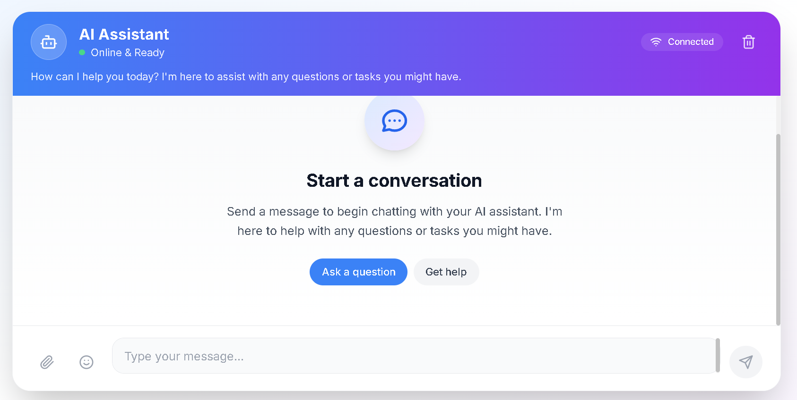

# Chatbot Interface for User

A lightweight and responsive front-end interface for interacting with AI chatbots. This project is designed to be modular and easily integratable with backends like OpenAI, Groq API, or custom LLM deployments.

## 💻 Chatbot UI Preview




## 🚀 Features

- Minimal and modern chat UI
- Clean separation of logic (HTML, CSS, JS)
- Ready to connect with any chatbot backend (REST API-based)
- Smooth UX for desktop and mobile users
- Extensible for RAG/LLM or Assistant-style use cases

## 📁 Project Structure

```
📦 Chatbot-Interface-for-User
├── index.html      # Main HTML page
├── style.css       # UI styling
├── script.js       # Chatbot interaction logic
├── README.md       # Project documentation
└── requirements.txt # Optional (for backend if needed)
```

## 🔧 Setup

1. Clone the repository
```bash
git clone https://github.com/Sibuninja/Chatbot-Interface-for-User.git
cd Chatbot-Interface-for-User
```

2. Open `index.html` in your browser to launch the chatbot UI.

3. Edit `script.js` to point to your backend API endpoint.

## 📡 Backend Integration Example

Update the fetch block in `script.js` like this:

```javascript
fetch('https://your-api.com/chat', {
    method: 'POST',
    body: JSON.stringify({ message: userInput }),
    headers: {
        'Content-Type': 'application/json'
    }
})
```

## ✨ Future Improvements

- Add dark mode toggle 🌙
- Display loading animations while waiting for responses
- Add speech-to-text or text-to-speech support
- Deploy on GitHub Pages or Vercel

## 🙋‍♂️ Author

**Shivansh Dhyani**  
📍 Gurugram, India  
[GitHub](https://github.com/Sibuninja) • [LinkedIn](https://linkedin.com/in/shivansh-dhyani-123zyx)

---

© 2025 Shivansh Dhyani. All rights reserved.
